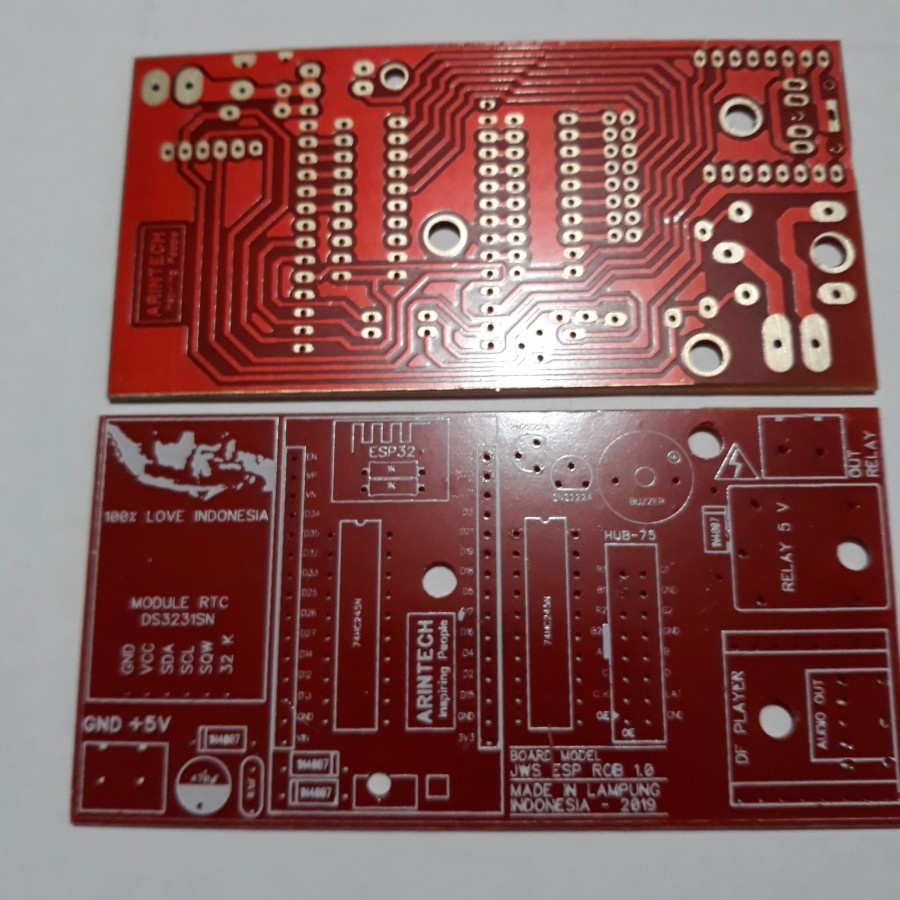
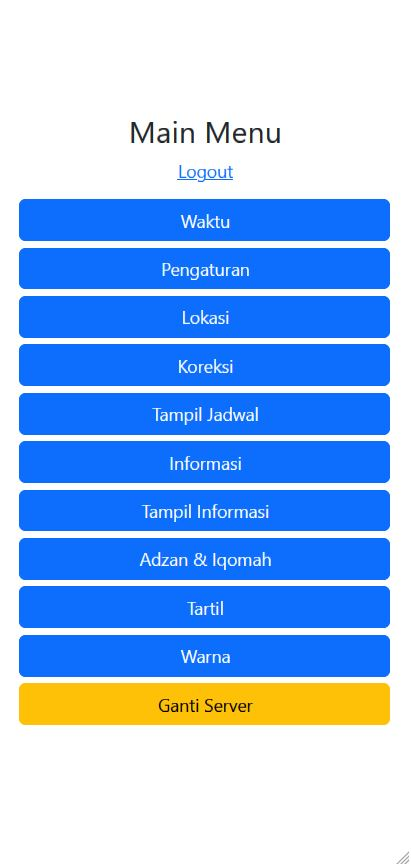
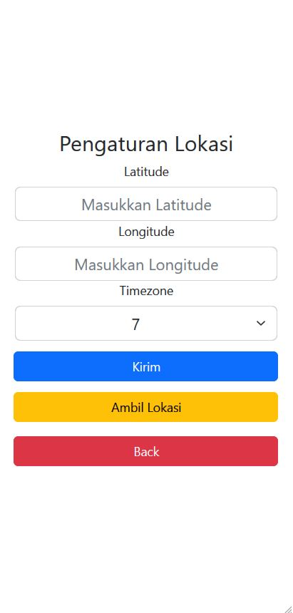
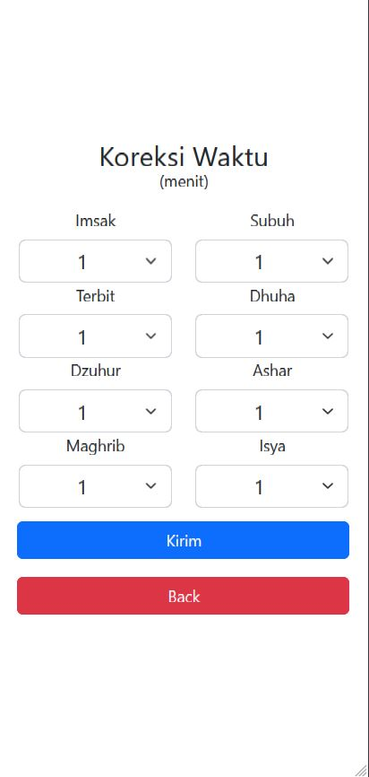
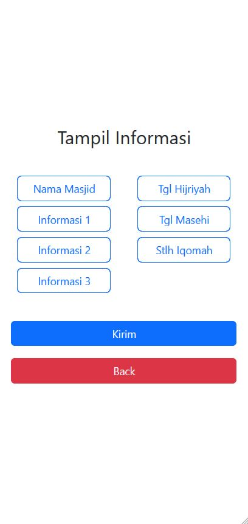

# JWS-ESP32-P10-RGB-OK
## _JWS dengan kontrol menggunakan Android (APK) melalui wifi_ 

## Hardware
- P10 RGB Display
- ESP32
- DF Player Mini
- Power supply
- Speaker
- PCB JWS ( banyak di pasaran, contoh seperti dibawah ini)

  

## Software
- Arduino IDE 1.8.19
  
## Features
- Jadwal sholat
- Kontrol APK standar wifi : 192.168.4.1 (Menggunakan Cordova)
- Pengaturan lokasi ( plus android geolocation )
- Adzan
- Suara jam ( setiap jam dan setiap setengah jam )
- Kalender Hijriah ( Kuwaiti_algorithm )
- Kalender Masehi ( plus hari pasaran )
- Jam Arah
- Info (nama masjid, 3 info, pesan sebelum sholat)
- Auto Tartil
- Pengaturan warna
- Countdown Iqomah

## File MP3
https://drive.google.com/drive/folders/1F2UkO_4xSV6sIagpgKBgfbYkbccjVRhU?usp=drive_link

## Cordova

Dalam membuat aplikasi APK menggunakan CORDOVA berbasis Javascript.
Plugin yang digunakan antara lain :

| Plugin | Sumber |
| ------ | ------ |
| cordova-plugin-advanced-http | github.com/silkimen/cordova-plugin-advanced-http|
| cordova-plugin-enable-cleartext-traffic | github.com/RahulCV/cordova-plugin-enable-cleartext-traffic |
| cordova-plugin-file | https://github.com/apache/cordova-plugin-file |
| cordova-plugin-geolocation | github.com/apache/cordova-plugin-geolocation|
| cordova-plugin-splashscreen | https://github.com/apache/cordova-plugin-splashscreen |

### _Cordova Requirment_
- cordova verion 12.0.0 (cordova-lib@12.0.2)
- openjdk version "17.0.6" 2023-01-17
- gradle verion 7.6 

### _Data yang dikirim_
```sh
2025-01-28 
04:23

2025-01-28
14:54

{"adjhijr":"4","adjcerah":"13","adjvolumeadzan":"15","adjvolume":"19","beepstatus":"0","modetampil":"1","relayon":"15:05","relayoff":"19:09","speedtext":"6","msholbi":"9","msholju":"5","jambesar":"135"}
{"latitude":"-6.21","longitude":"106.85","zonawaktu":"7"}
{"korimsak":"2","korsubuh":"2","korterbit":"2","kordhuha":"2","kordzuhur":"2","korashar":"2","kormaghrib":"2","korisya":"2"}
{"tpl_imsak":"1","tpl_subuh":"1","tpl_terbit":"0","tpl_dhuha":"0","tpl_dzuhur":"1","tpl_ashar":"1","tpl_maghrib":"1","tpl_isya":"1"}
{"namamasjid":"Nama Masjid","info1":"Info 1","info2":"Info 2","info3":"Tempat Info 3","stlhiqomah":"Matikan HP - Luruskan Shaf"}
{"tpl_nama":"1","tpl_pesan":"0","tpl_pesan2":"1","tpl_pesan3":"0","tpl_hijriyah":"0","tpl_masehi":"1","tpl_matikan":"0"}
{"lamaadzan":"4","lamaimsak":"1","iqomahsubuh":"2","iqomahdzuhur":"2","iqomahashar":"2","iqomahmaghrib":"2","iqomahisya":"2"}
{"imsak":"24|08:14","subuh":"29|06:27","dzuhur":"22|18:48","ashar":"23|15:07","maghrib":"25|18:51","isya":"27|14:36","jumat":"21|22:14"}
{"col_jam":"#ff0000","col_waktu":"#ffff00","col_info":"#00ffff","col_jam_adzan":"#00ff00","col_adzan":"#ff00ff","col_jam_iqomah":"#00ffff","col_iqomah":"#a600ff","col_shaf":"#0000ff"}

```
### _Tampilan Aplikasi_

 
 
